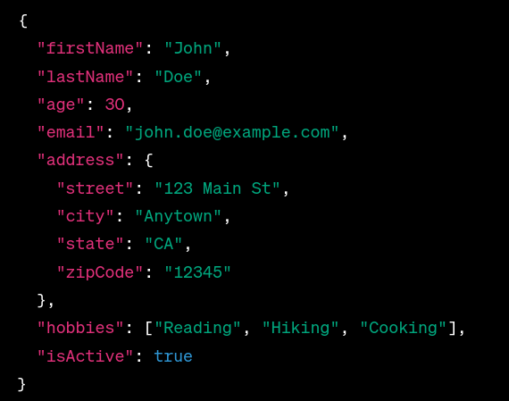
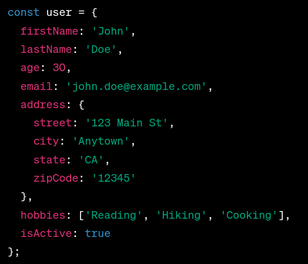

# MongoDB Udemy course
- Excel in NoSQL & Pass Certification

## ROADMAP so far
- Installing mongoDB using docker image [Tutorial how to](https://www.mongodb.com/docs/manual/tutorial/install-mongodb-community-with-docker/#std-label-docker-mongodb-community-install)
- To start the mongosh using this docker image, use this command docker exec -it nomeDoContainer mongosh
- local database created, with no auth, some issues here
- Class number 8, MongoDB origins and benefits
- Class number 9, the differences of MongoDB and SQL databases
- Class number 12, how mongoDB works
- Connecting with a database, with and without auth 
- insertOne, insertMany, find and more (CRUD)
- More queries, operators
- Embedded documents
- Querrying arrays in documents

[//]: # (

Annotations

)

### MongoDB terminologies
- It's like JSON structure

click to see JSON

click to see MongoDB

List of terminologies

Here is a list of MongoDB terminologies commonly used in MongoDB:

1. **Document**: A basic unit of data in MongoDB, equivalent to a row in a relational database. Documents are BSON (Binary JSON) objects that can contain fields and values.

2. **Collection**: A group of MongoDB documents, similar to a table in a relational database. Collections do not enforce a schema, so documents within a collection can have different structures.

3. **Database**: A logical container for collections and documents in MongoDB. A server can host multiple databases, each with its collections and documents.

4. **Field**: A key-value pair within a MongoDB document. Fields represent the individual pieces of data stored in documents.

5. **BSON**: Binary JSON, the binary serialization format used by MongoDB to store and exchange data. BSON extends JSON to include additional data types and binary support.

6. **Query**: A request for data retrieval from a MongoDB database. Queries are constructed using the MongoDB Query Language (MQL) and can filter, sort, and limit the results.

7. **Cursor**: A pointer to the result set of a query. Cursors allow clients to retrieve documents from a query result in a paginated manner.

8. **Index**: A data structure that improves the speed of data retrieval operations on a MongoDB collection. Indexes are created on specific fields and allow for efficient querying.

9. **Primary Key**: A unique identifier for each document within a collection. In MongoDB, the `_id` field serves as the primary key by default.

10. **Replica Set**: A group of MongoDB servers that maintain the same data set for redundancy and high availability. One server is the primary, while the others are secondary nodes.

11. **Sharding**: A database architecture strategy in MongoDB for distributing data across multiple servers or clusters to improve scalability and performance.

12. **Aggregation**: The process of transforming data in MongoDB using operations like `$match`, `$group`, `$project`, and more. Aggregation is used to perform complex data analysis and calculations.

13. **Atlas**: MongoDB Atlas is the cloud-based database service provided by MongoDB, Inc. It offers managed MongoDB instances in various cloud environments.

14. **Document Store**: MongoDB is often referred to as a document store because it stores data in BSON documents, making it suitable for semi-structured and unstructured data.

15. **GridFS**: A specification for storing and retrieving large binary files in MongoDB, typically used for multimedia files like images, videos, and audio.

16. **Geospatial Index**: An index that allows MongoDB to perform geospatial queries, such as finding documents within a specific geographical area.

17. **Authentication and Authorization**: MongoDB provides authentication mechanisms to control access to databases and collections. Roles and privileges are used for authorization.

18. **Aggregation Pipeline**: A framework for data transformation and processing in MongoDB that allows documents to pass through a series of stages, each performing a specific operation.

19. **Change Streams**: A feature that allows clients to listen for changes in a MongoDB collection in real-time. It can be used for building reactive applications.

20. **Map-Reduce**: A data processing technique in MongoDB for performing complex data transformations and aggregations. It involves a map function, a reduce function, and an output collection.

These MongoDB terminologies should help you better understand and work with MongoDB databases and collections.

### MongoDB benefits
 

   
click to see

MongoDB offers several benefits that make it a popular choice for many applications:

1. **Flexible Schema:** MongoDB is a NoSQL database that uses a flexible document-based data model (BSON). It allows you to store data in a format similar to JSON, and each document in a collection can have a different structure. This flexibility is particularly useful for applications with evolving or dynamic data requirements.

2. **Scalability:** MongoDB is designed to scale horizontally, making it suitable for handling large volumes of data and high traffic loads. It supports sharding, which allows you to distribute data across multiple servers or clusters to ensure high availability and performance.

3. **High Performance:** MongoDB is known for its high read and write performance. It employs various optimization techniques like indexing, query optimization, and memory mapping to provide fast data access.

4. **Rich Query Language:** MongoDB provides a powerful query language that supports a wide range of query operations, including complex aggregations and geospatial queries. It also supports full-text search.

5. **Geospatial Data:** MongoDB has built-in support for geospatial data and queries, making it an excellent choice for location-based applications.

6. **Automatic Failover:** MongoDB supports automatic failover using replica sets. In the event of a primary node failure, one of the secondary nodes is automatically elected as the new primary, ensuring high availability.

7. **Document Indexing:** MongoDB allows you to create various types of indexes, including compound indexes and geospatial indexes, to improve query performance.

8. **Community and Ecosystem:** MongoDB has a large and active community of users and contributors. It also offers official drivers and client libraries for various programming languages, making it easy to integrate with your application.

9. **Aggregation Framework:** MongoDB provides a robust aggregation framework for performing complex data transformations and computations, allowing you to process and analyze data within the database.

10. **Schema Evolution:** MongoDB's flexible schema and versioning support make it easy to evolve your data model over time without requiring extensive migrations.

11. **Security Features:** MongoDB offers various security features, including authentication, role-based access control, encryption at rest and in transit, and auditing, to protect your data.

12. **Cloud Integration:** MongoDB Atlas, the official cloud-hosted MongoDB service, simplifies database management, scaling, and monitoring in a cloud environment. It integrates seamlessly with popular cloud providers.

While MongoDB has many advantages, it's essential to evaluate your specific use case and requirements to determine whether it's the right choice for your application.  

### MongoDB differences to SQL

click to see

MongoDB and traditional SQL databases differ in several key ways:

1. **Data Model:**
   - **MongoDB:** MongoDB is a NoSQL database that uses a flexible, document-based data model. Data is stored in BSON (binary JSON) documents, and each document in a collection can have a different structure.
   - **SQL:** SQL databases use a structured, table-based data model. Data is organized into tables with predefined schemas consisting of rows and columns.

2. **Schema:**
   - **MongoDB:** MongoDB has a dynamic schema, which means you can change the structure of documents without affecting other documents in the same collection. This flexibility is useful for applications with evolving data requirements.
   - **SQL:** SQL databases have a rigid schema where the structure of tables and relationships between them are defined upfront. Changing the schema often requires complex migrations.

3. **Query Language:**
   - **MongoDB:** MongoDB uses a rich query language that includes support for querying nested documents, geospatial queries, and text search. Queries are expressed in a JSON-like format.
   - **SQL:** SQL databases use SQL (Structured Query Language) for querying data, which is a standardized language for relational databases. SQL offers powerful querying capabilities for structured data.

4. **Scaling:**
   - **MongoDB:** MongoDB is designed for horizontal scalability. It supports sharding, which allows data to be distributed across multiple servers or clusters to handle large data volumes and high traffic loads.
   - **SQL:** SQL databases typically scale vertically by adding more resources (CPU, RAM) to a single server. Scaling out can be challenging and may involve complex clustering solutions.

5. **ACID vs. BASE:**
   - **MongoDB:** MongoDB is often associated with the BASE (Basically Available, Soft state, Eventually consistent) model. It prioritizes high availability and partition tolerance over strong consistency, making it suitable for certain use cases like content management systems and real-time analytics.
   - **SQL:** SQL databases adhere to the ACID (Atomicity, Consistency, Isolation, Durability) properties, which guarantee strong consistency and transactional integrity. ACID is crucial for applications where data consistency is paramount, such as financial systems.

6. **Join Operations:**
   - **MongoDB:** MongoDB does not support traditional SQL-style joins between collections. Instead, it encourages denormalization and embedding related data within documents.
   - **SQL:** SQL databases excel at performing complex join operations between tables, allowing you to model and query normalized data efficiently.

7. **Complex Transactions:**
   - **MongoDB:** MongoDB supports multi-document transactions, but they are not as mature as SQL database transactions. Transactions are generally used for scenarios where data consistency is critical.
   - **SQL:** SQL databases offer robust support for complex transactions with features like rollback, commit, and savepoints.

8. **Schema Evolution:**
   - **MongoDB:** MongoDB's flexible schema makes it easier to evolve data models over time without significant schema migrations.
   - **SQL:** SQL databases require careful schema design and management, and schema changes can be complex and time-consuming.

The choice between MongoDB and SQL databases depends on your specific project requirements, data model, and use cases. Each has its strengths and weaknesses, and the decision should align with your application's needs.

### MongoDB Operators
 

   
click to see

MongoDB provides various operators to perform operations on data. Here's a list of some commonly used MongoDB operators:

**Comparison Operators:**
1. `$eq`: Matches values that are equal to a specified value.
2. `$ne`: Matches values that are not equal to a specified value.
3. `$gt`: Matches values that are greater than a specified value.
4. `$gte`: Matches values that are greater than or equal to a specified value.
5. `$lt`: Matches values that are less than a specified value.
6. `$lte`: Matches values that are less than or equal to a specified value.
7. `$in`: Matches any of the values specified in an array.
8. `$nin`: Matches none of the values specified in an array.

**Logical Operators:**
9. `$and`: Joins query clauses with a logical AND and returns documents that match both conditions.
10. `$or`: Joins query clauses with a logical OR and returns documents that match at least one condition.
11. `$not`: Inverts the effect of a query expression and returns documents that do not match the specified condition.
12. `$nor`: Joins query clauses with a logical NOR and returns documents that do not match any condition.

**Element Operators:**
13. `$exists`: Matches documents that have the specified field.
14. `$type`: Matches documents that have a field of a specified type.

**Evaluation Operators:**
15. `$expr`: Allows the use of aggregation expressions within the query language.
16. `$jsonSchema`: Validates documents against a given JSON schema.
17. `$mod`: Performs a modulo operation on the value of a field and selects documents with a specified result.
18. `$regex`: Matches documents that satisfy a regular expression.

**Array Operators:**
19. `$all`: Matches documents that contain all elements specified in an array.
20. `$elemMatch`: Matches documents that contain an array field with at least one element that matches all specified criteria.
21. `$size`: Matches documents where the size of an array field meets the specified value.

**Projection Operators:**
22. `$`: Projects the first element in an array that matches the query condition.
23. `$elemMatch`: Projects the first element in an array that matches the specified condition.

**Array Update Operators (for use with `$push`, `$pull`, `$addToSet`, etc.):**
24. `$each`: Modifies arrays with multiple values in a single operation.
25. `$slice`: Limits the number of elements in an array.
26. `$position`: Specifies the position for an operation.
27. `$sort`: Sorts elements in an array.

**Geospatial Operators:**
28. `$geoWithin`: Selects documents with a specified geometric shape within a bounding geoJSON geometry.
29. `$geoIntersects`: Selects documents with a geometric shape that intersects with a specified geoJSON geometry.
30. `$near`: Returns geospatially nearest documents.

These operators can be used in MongoDB queries and updates to perform a wide range of operations on your data. Keep in mind that MongoDB also provides aggregation operators for more advanced data manipulation in aggregation pipelines.

